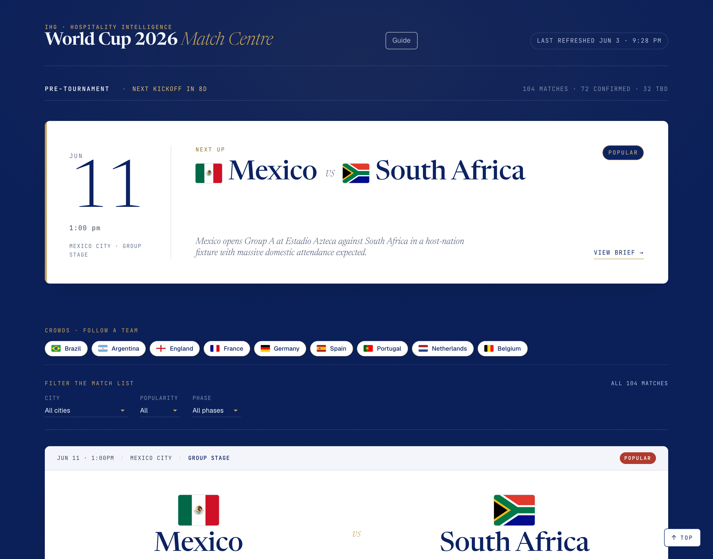
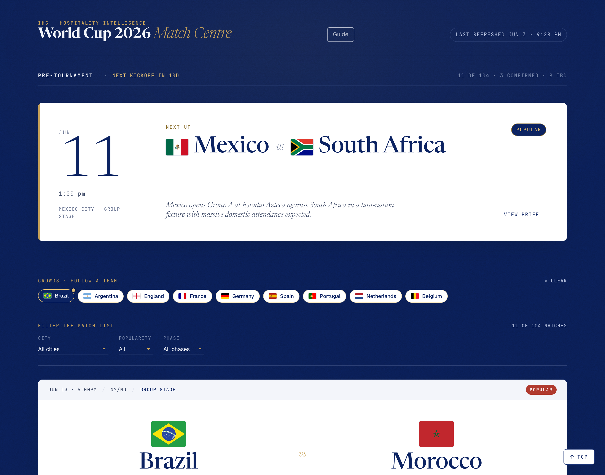
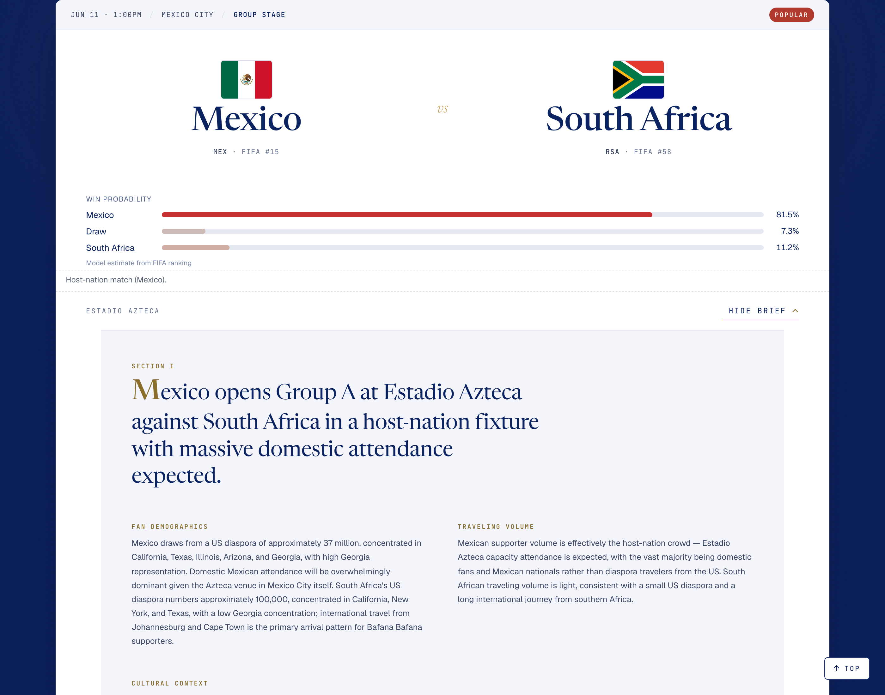

# Rollout email — World Cup 2026 Match Centre

A short, skim-friendly all-hands email to introduce hotel teams to the Match Centre. Edit the subject line, greeting, and sign-off to match your distribution list; attach the three screenshots in `docs/rollout/` (or paste them inline).

**Reading time:** ~2 minutes.

---

> **Subject:** New for World Cup 2026 — a Match Centre for your property
>
> **From:** Commercial Sales
> **To:** Hotel teams (GMs · Revenue · Sales · Operations)

---

Hi all,

Ahead of the FIFA World Cup 2026 (11 June – 19 July), we've stood up a single-page Match Centre that summarises every one of the 104 matches in plain language — who's playing, where, when, and what kind of crowd to expect.

It's descriptive, not prescriptive. It won't tell your property what to do. It gives you the context your team would otherwise have to gather from a dozen sources.

**The site:** https://teresanguyen-ihg.github.io/world-cup-2026-intelligence-site/
**Orientation guide:** [How to read it](https://teresanguyen-ihg.github.io/world-cup-2026-intelligence-site/guide.html)

---

### What you'll see when you open it

A tournament banner at the top, a "Next Up" card flagging the next high-attention match, a row of team chips for the global-draw nations, the city / popularity / phase filters, and the full match list below.

The data refreshes every 30 minutes during the group stage and every 15 minutes once knockouts start, so what you see is always close to live.

---

### Three things worth knowing

**1 · Filter by team in one click.**

The chip row labeled *Crowds · follow a team* surfaces the nine nations that travel in the largest numbers (Brazil, Argentina, England, France, Germany, Spain, Portugal, Netherlands, Belgium). Tap one and the match list filters to every match that team is in — including knockout slots where they're a likely candidate.

**2 · Each match opens into a fan briefing.**

Click *View brief* on any tile and you get a short, neutral writeup: who travels for that team, how heavy the volume is expected to be, and the cultural context — food traditions, religious or dietary observances, language patterns. Useful if you're prepping front-of-house or F&B for an unfamiliar audience.

**3 · "Popular / Moderate / Standard" is rule-based, not editorial.**

The badge on each tile is auto-assigned from a deterministic rule (finals, top-10 teams, host nations, global-draw brands). The exact triggers are in the *How match popularity is computed* panel at the bottom of the page, and in the [Guide](https://teresanguyen-ihg.github.io/world-cup-2026-intelligence-site/guide.html). No one curates these by hand.

---

### Questions or corrections

If something looks wrong — a venue, a kickoff, a team mix — write to **commercialsales@ihg.com** and we'll get it fixed.

Thanks,
*— Commercial Sales*

---

> *Legal notice — IHG Hotels & Resorts is not a sponsor, partner, or affiliate of FIFA or the 2026 World Cup. This content provides general guidance for hotels.*
